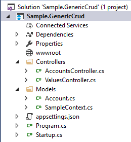

LSG.GenericCrud - Visual Studio Code Sample #1
=
This sample show you all the steps required to use this library using Visual Studio 2015 update 3+.

At this end of this tutorial, your Visual Studio Code workspace should look like this:



and you will have these routes available for the account entity

| VERB   | URL               | Description           |
|--------|-------------------|-----------------------|
| GET    | /api/accounts     | Retreive all accounts |
| GET    | /api/accounts/:id | Retreive one account  |
| POST   | /api/accounts     | Create one account    |
| PUT    | /api/accounts/:id | Update one account    |
| DELETE | /api/accounts/:id | Delete one account    |

## Getting started
In Visual Studio, execute the following actions:
- Create a new project:
    - Project Type: **ASP.NET Core Web Application**
    - Name: Sample.GenericCrud
- Select in the next windows **Web API**    
    
    **Note:** You can choose to target .NET Framework 4.6.1+ or .NET Core 2.0+ because the LSG.GenericCrud library is .NET Standard 2.0 Compliant. The important thing is to use the new **ASP.NET Core Web Application**.

When the project is created, you need to refer to an external library **LSG.GenericCrud**. To do so:
- Right-click dependencies, Manage Nuget Packages...
- Browse for **LSG.GenericCrud**
- Click **Install**

    Note: You can pass through **Package management console** and type directly the **Install-Package** command instead of doing all these previous steps.

## Create needed assets
These steps will create needed assets required to make work a simple controller connected to an InMemory EntityFrameworkCore entity CRUD.

### Create data models and database context

- Create a new folder named: **Models**

- Add a new class, in **Models** folder, named: **Account.cs**

```csharp
using System;
using LSG.GenericCrud.Models;

namespace Sample.GenericCrud.Models
{
    public class Account : IEntity
    {
        public Account()
        {
            Id = Guid.NewGuid();
        }
        public Guid Id { get; set; }
        public string Name { get; set; }
    }
}
```

- Add a new class, in **Models** folder, named: **SampleContext.cs**

```csharp
using System;
using LSG.GenericCrud.Repositories;
using Microsoft.EntityFrameworkCore;

namespace Sample.GenericCrud.Models
{
    public class SampleContext : BaseDbContext, IDbContext
    {
        public SampleContext(DbContextOptions options, IServiceProvider serviceProvider) : base(options, serviceProvider) {}

        public DbSet<Account> Accounts { get; set; }
    }
}
```

### Create WebApi controller

- Create a new folder named (if not already created): **Controllers**

- Add a new class, in **Controllers* folder, named: **AccountsController.cs**

```csharp
using LSG.GenericCrud.Controllers;
using LSG.GenericCrud.Repositories;
using Microsoft.AspNetCore.Mvc;
using Sample.GenericCrud.Models;

namespace Sample.GenericCrud.Controllers
{
    [Route("api/[controller]")]
    public class AccountsController : CrudController<Account>
    {
        public AccountsController(ICrudService<Account> service) : base(service)
        {
        }
    }
}
```

### Final adjustments
Adjust **Startup.cs** class to enable injection and GenericCrud modules. The class should look like this.

```csharp
public class Startup
{
    public void ConfigureServices(IServiceCollection services)
    {
        // to activate mvc service
        services.AddMvc();
        // to load an InMemory EntityFramework context
        services.AddDbContext<SampleContext>(opt => opt.UseInMemoryDatabase());
        services.AddTransient<IDbContext, SampleContext>();
        // inject needed service and repository layers
        services.AddScoped(typeof(ICrudService<>), typeof(CrudService<>));
        services.AddScoped(typeof(ICrudRepository<>), typeof(CrudRepository<>));
    }

    public void Configure(IApplicationBuilder app, IHostingEnvironment env)
    {
        // activate mvc routing
        app.UseMvc();
    }
}
```

## Start application

Press F5 (to compile and run the web app). After a while, a web page will open.

- Go to **http://localhost:\<PORT\>/api/accounts**, and you are done!

## Testing!

Note: If you want to use this postman collection, you will have to change the Web Service Settings (App URL) to use **port 5000**. (right-click project, properties, debug)

Here is a [Postman](https://www.getpostman.com/) collection to test your new RESTful CRUD api

[](https://app.getpostman.com/run-collection/090af27316cd23c61951)

## Source

Sample source code is available [here](https://github.com/lonesomegeek/LSG.GenericCrud.Samples).