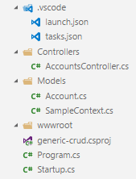

LSG.GenericCrud - Visual Studio Code Sample #1
=
This sample show you all the steps required to use this library using Visual Studio Code.

At this end of this tutorial, your Visual Studio Code workspace should look like this:



and you will have these routes available for the account entity

| VERB   | URL               | Description           |
|--------|-------------------|-----------------------|
| GET    | /api/accounts     | Retreive all accounts |
| GET    | /api/accounts/:id | Retreive one account  |
| POST   | /api/accounts     | Create one account    |
| PUT    | /api/accounts/:id | Update one account    |
| DELETE | /api/accounts/:id | Delete one account    |

**Note:** You don't even need Visual Studio Code at all for this tutorial (for hardcore ones =P). You can do all these steps on the command line if you want.

## Getting started
Using the command line, execute the following commands:
- Create a new **dotnet core web** app

    ```bash
    dotnet new web -o Sample.GenericCrud
    ```

- Enter newly created folder

    ```bash
    cd Sample.GenericCrud
    ```

- Add requried LSG.GenericCrud library

    ```bash
    dotnet add package LSG.GenericCrud
    ```

- Open visual studio code to continue the next steps

    ```bash
    code .
    ```

## Create needed assets
These steps will create needed assets required to make work a simple controller connected to an InMemory EntityFrameworkCore entity CRUD.

### Create data models and database context

- Create a new folder named: **Models**

- Add a new class, in **Models** folder, named: **Account.cs**

```csharp
using System;
using LSG.GenericCrud.Models;

namespace Sample.GenericCrud.Models
{
    public class Account : IEntity
    {
        public Account()
        {
            Id = Guid.NewGuid();
        }
        public Guid Id { get; set; }
        public string Name { get; set; }
    }
}
```

- Add a new class, in **Models** folder, named: **SampleContext.cs**

```csharp
using System;
using LSG.GenericCrud.Repositories;
using Microsoft.EntityFrameworkCore;

namespace Sample.GenericCrud.Models
{
    public class SampleContext : BaseDbContext, IDbContext
    {
        public SampleContext(DbContextOptions options, IServiceProvider serviceProvider) : base(options, serviceProvider) {}

        public DbSet<Account> Accounts { get; set; }
    }
}
```

### Create WebApi controller

- Create a new folder named: **Controllers**

- Add a new class, in **Controllers* folder, named: **AccountsController.cs**

```csharp
using LSG.GenericCrud.Controllers;
using LSG.GenericCrud.Repositories;
using Microsoft.AspNetCore.Mvc;
using Sample.GenericCrud.Models;

namespace Sample.GenericCrud.Controllers
{
    [Route("api/[controller]")]
    public class AccountsController : CrudController<Account>
    {
        public AccountsController(Crud<Account> dal) : base(dal) { }
    }
}
```

### Final adjustments
Adjust **Startup.cs** class to enable injection and GenericCrud modules. The class should look like this.

```csharp
public class Startup
{
    public void ConfigureServices(IServiceCollection services)
    {
        // to activate mvc service
        services.AddMvc();
        // to load an InMemory EntityFramework context
        services.AddDbContext<SampleContext>(opt => opt.UseInMemoryDatabase());
        services.AddTransient<IDbContext, SampleContext>();
        // to dynamically inject any type of Crud repository of type T in any controllers
        services.AddScoped(typeof(Crud<>));
    }

    public void Configure(IApplicationBuilder app, IHostingEnvironment env)
    {
        // activate mvc routing
        app.UseMvc();
    }
}
```

## Start application

- Restore .NET libraries

```bash
dotnet restore
```

- Build the project

```bash
dotnet build
```

- Execute the project

```bash
dotnet run
```

- Go to **http://localhost:5000/api/accounts**, and you are done!

## Testing!

Here is a [Postman](https://www.getpostman.com/) collection to test your new RESTful CRUD api

[](https://app.getpostman.com/run-collection/090af27316cd23c61951)

## Source

Sample source code is available [here](https://github.com/lonesomegeek/LSG.GenericCrud.Samples).
