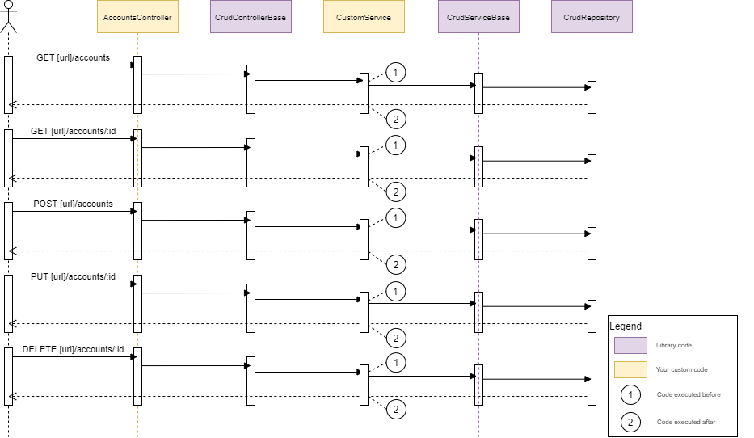

Here is a sample of how to "implement" from *CrudServiceBase* code base in a custom service layer.

```csharp
public class CustomImplementedCrudService<T1, T2> : ICrudService<T1, T2> where T2 : class, IEntity<T1>, new()
{
    private readonly CrudServiceBase<T1, T2> _service;

    public CustomImplementedCrudService(CrudServiceBase<T1, T2> service)
    {
        _service = service;
    }

    public bool AutoCommit { get; set; }

    public async Task<T2> CopyAsync(T1 id) => await _service.CopyAsync(id);
    public async Task<T2> CreateAsync(T2 entity) => await _service.CreateAsync(entity);
    public async Task<T2> DeleteAsync(T1 id) => await _service.DeleteAsync(id);
    public async Task<IEnumerable<T2>> GetAllAsync() => await _service.GetAllAsync();
    public async Task<T2> GetByIdAsync(T1 id) => await _service.GetByIdAsync(id);
    public async Task<T2> UpdateAsync(T1 id, T2 entity) => await _service.UpdateAsync(id, entity);
}
```

Here is a better overview of what you can do before and after each action with this sequence diagram. Please note that with this technique, you can do whateaver you want before or after the *base* action, but, you can't change the *base* behaviour.

[](./sequence-StandardCrud_CustomService.png)

```csharp
public class CustomImplementedCrudService<T1, T2> : ICrudService<T1, T2> where T2 : class, IEntity<T1>, new()
{
    private readonly CrudServiceBase<T1, T2> _service;

    public CustomImplementedCrudService(CrudServiceBase<T1, T2> service)
    {
        _service = service;
    }

    public bool AutoCommit { get; set; }

    public async Task<T2> CopyAsync(T1 id) {
        // 1: execute before action
        var result = await _service.CopyAsync(id);
        // 2: execute after action
        return result; // or altered result from step "2"
    }

    public async Task<T2> CreateAsync(T2 entity) {
        // 1: execute before action
        var result = await _service.CreateAsync(entity);
        // 2: execute after action
        return result; // or altered result from step "2"
    }
    
    public async Task<T2> DeleteAsync(T1 id) {
        // 1: execute before action
        var result = await _service.DeleteAsync(id);
        // 2: execute after action
        return result; // or altered result from step "2"
    }
    
    public async Task<IEnumerable<T2>> GetAllAsync() {
        // 1: execute before action
        var result =  await _service.GetAllAsync();
        // 2: execute after action
        return result; // or altered result from step "2"
    }
    
    public async Task<T2> GetByIdAsync(T1 id) { 
        // 1: execute before action
        var result = await _service.GetByIdAsync(id);
        // 2: execute after action
        return result; // or altered result from step "2"
    }
    
    public async Task<T2> UpdateAsync(T1 id, T2 entity) {
        // 1: execute before action
        var result = await _service.UpdateAsync(id, entity);
        // 2: execute after action
        return result; // or altered result from step "2"
    }
}
```